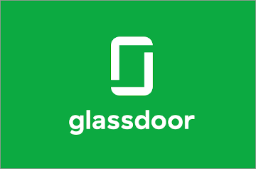

## Rex Software Glassdoor Review

[Glassdoor](./) | [Balance](../) | [Home](../../..)

This is listinglab's review of working for Rex.

### Overview

I worked at Rex for 3 months. I wish I hadn't. It was obvious from day 1 that it was a bad fit and had I had the choice I would have walked at the end of the first week. I did not. I stayed for 3 months and this is what I think of the company. IMHO.

So day one starts with some serious indoctrination. "We do this", "We do that"... blah blah. It all sounds kind of cool and groovy. You'll have your gym membership and free Tim tams rammed down your throat, which is fair enough. Where it's less good is that the company will tell you that they're flexible and relaxed. They are not.

The company "doesn't do timesheets" is another. Great. We all hate timesheets. What isn't said is that instead of that, there are 10 other ways you are expected to account for every minute of your day. You're even expected to send the founders a friendly update email every fortnight. Please. The founders are welcome to ask me personally how I'm going, but policies like that are for dicks.

Rex as a company seems properous and with good reason. The company sells a Real Estate CRM solution and the sales dept is second to none, run by founder Lana.

The design/marketing team support sales well and with equally strong customer support and very low overhead you've got great business.

Unfortunately I didn't work in any of those areas because I'm a software developer. The software development department **is** Rex's overhead and working there feels like that.

The company founding story says it all. Lana, successful in Real Estate herself knew that it was because she had a superior system. She convinced Alex, her son, to turn that system into software which is now called the 'rex core product'. Then she built a company around it.

A decade down the road, Alex is now CTO of a thriving company and out of his depth.

The biggest question that Rex isn't facing is: how do we rimraf our piece of shit software and turn it into something that can move forward?

The attidude is that 'our customers are soooo important'. That's nice, but as Henry Ford said; If I'd listened to my customers I'd have given them a faster horse.
