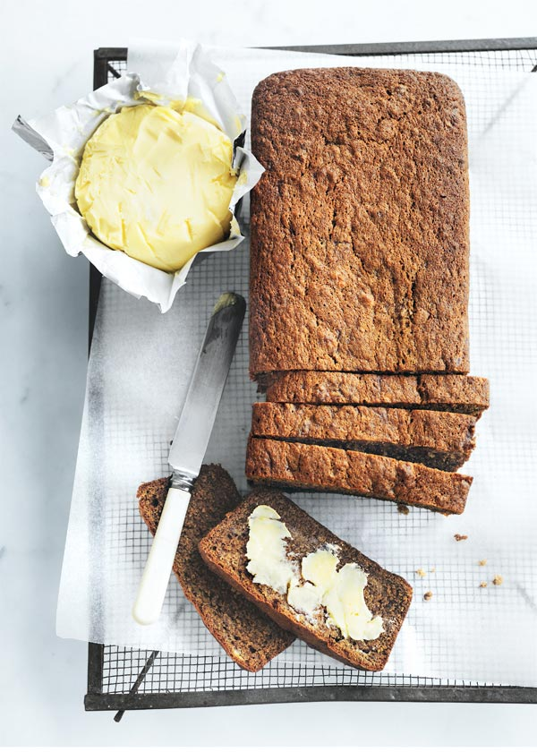

## Banana Bread

### Ingredients

- 125g Butter
- 175g Brown sugar
- 1 tsp Vanilla extract or paste
- 3 Eggs
- 2 Cups mashed banana
- 255g Plain flour
- 1 tsp Baking powder
- 1 tsp Bicarb of (baking) soda
- 1 tsp Ground cinnamon
- ⅓ CUP (115g) Golden Syrup

### Method

1. Preheat oven to 160°C
   Place the butter, sugar and vanilla in an electric mixer and
   beat for 8–10 minutes or until pale and creamy.
   Scrape down the sides of the bowl.

2. Gradually add the eggs and beat well to combine.
   Add the banana, flour, baking powder, bicarbonate of soda,
   cinnamon and golden syrup and stir to combine.

3. Spoon the mixture into a 26cm x 11cm (2.5 litre-capacity)
   lightly greased loaf tin lined with baking paper.
   Bake for 60–65 minutes or until cooked when tested with a skewer.

4. Cool in the tin for 20 minutes before turning out
   onto a wire rack to cool completely.
   Slice and serve with the extra butter. Serves 6–8.

[source](https://www.donnahay.com.au/recipes/banana-bread)

[UP](../index)
