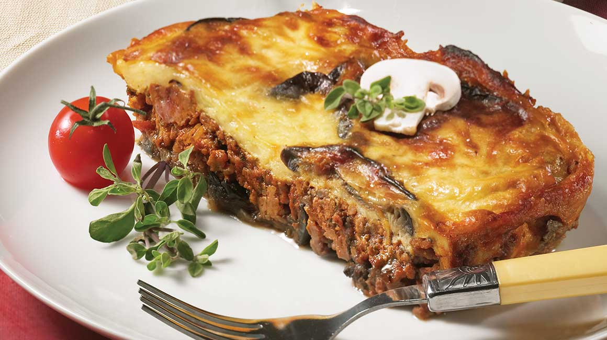

## Moussaka

Portions: 10
Time: All day.

## Ingredients

- 3 large eggplants
- 1 red & 1 white onion
- salt & prpper
- crushed garlic
- 1kg lamb mince
- Olive oil
- celery
- carrot
- 250g potato (sliced)
-

#### meat sauce

#### bechemal

## Method

Prepare the containers. If you wish to freeze the dish, an alufoil container works well as it can be easily heated up in an oven.

[UP](../index)
