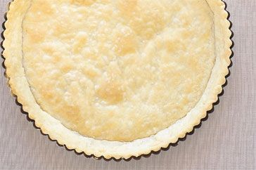

## Quiche Base

[Food](./) | [Life](../) | [Home](../../..)

### Ingredients

- 400g plain flour
- Salt
- 100g butter
- 2 egg yolks

### Method

1. Add 1tsp of salt to the flour and rub in the butter until breadcrumb consistancy
2. Add the egg yolks and combine
3. Add small amounts of cold water until the pastry comes together
4. Wrap in clingfilm and rest in the fridge for 30 mins
5. Roll out the pastry neatly and press it carefully into your pie dish
6. Blind bake the pastry base for 12 mins at 180 deg C
7. Leave to cool while you prepare the filling
