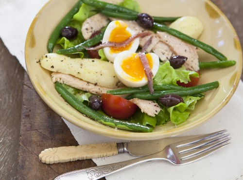

## Salade nicoise

[Food](./) | [Life](../) | [Home](../..)

(niçoise)

### Ingredients

- 3 eggs, preferably home-made
- 1 mignonette lettuce, or 2 large handfuls soft-leafed salad selection
- 200 g beans, freshly boiled
- 2 ripe tomatoes, cut into wedges
- 200 g canned tuna, in olive oil
- 2–4 potatoes, freshly boiled and cut into chunks or halved
- 2 tablespoons extra-virgin olive oil
- 1 teaspoon wine vinegar, optional
- salt & freshly ground black pepper
- 16 black olives, small (or chopped sundried tomatoes if you don't like olives)
- 8 anchovy fillets, split lengthwise

### Method

Boil eggs for 4 minutes, then run under cold water to stop the cooking. Peel and cut into quarters (the yolks should still be moist). Cover a platter with washed, dried salad leaves. Gently mix warm beans, tomato, drained tuna, potato and egg with olive oil, vinegar (if the tomatoes are not too acidic), salt and pepper and tumble onto salad leaves. Scatter olives and anchovies over and serve immediately.

[Source](https://www.stephaniealexander.com.au/what-to-cook/recipes/salade-nicoise/)
